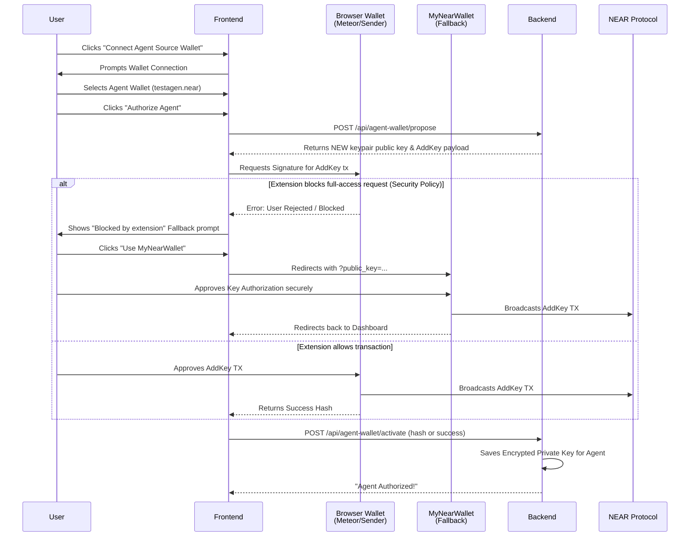
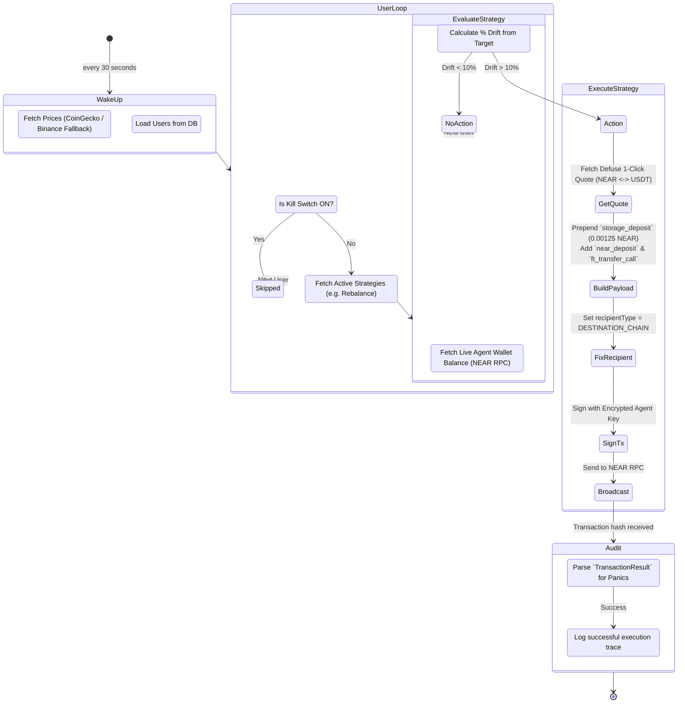

# Neptune AI

Neptune AI is a powerful agentic application that combines a Next.js frontend with a Python (FastAPI) backend to perform actions on the NEAR blockchain using AI.

## Project Structure

- **Backend**: `ai-agent-backend/` (FastAPI, Python)
- **Frontend**: `NeptuneAI_V2/` (Next.js, React)

---

## 🏗️ High-Level System Architecture

Neptune AI is built on a decoupled, secure architecture. Users hold their main assets in their primary wallet, while provisioning a separate "Agent Wallet" loaded with a budget explicitly for the AI to trade autonomously.

```mermaid
graph TD
    %% Frontend Layer
    subgraph Frontend [Next.js Dashboard & UI]
        Chat[Natural Language Chat UI]
        Dash[Autonomy Dashboard]
        HotKit[Wallet Connector - HotKit]
    end

    %% Web3 Layer
    subgraph Wallets [User Web3 Environment]
        MainWallet((Primary Wallet<br>Read-Only for App))
        AgentWallet((Agent Wallet<br>Trades Budget))
    end

    %% Backend Layer
    subgraph Backend [FastAPI Backend Engine]
        API[REST API Layer]
        LLM[Notification & NLP Agent <br> OpenAI / Near AI]
        Scheduler([APScheduler Engine<br>Runs every 30s])
        
        subgraph Databases
            SQLite[(SQLite Database)]
            UserStore[User Preferences & Kill Switch]
            StrategyStore[Active Strategies]
            KeyStore[Encrypted Agent Keys]
        end
    end

    %% External Protocols
    subgraph Web3 Protocols [On-Chain Infrastructure]
        RPC(NEAR Mainnet RPC)
        FastNEAR(FastNEAR Indexer)
        Defuse(Defuse 1-Click Intents)
        Market(CoinGecko / Binance)
    end

    %% Connections
    Chat -->|Natural Language Intents| API
    Dash -->|Strategy Configuration| API
    Dash -.->|Web3 Signing| Wallets
    HotKit -->|Connect| MainWallet
    HotKit -->|Connect Source| AgentWallet

    API --> SQLite
    Scheduler --> API
    Scheduler -->|Read Strategies| StrategyStore
    Scheduler -->|Fetch Prices| Market
    Scheduler -->|Fetch Balances| FastNEAR

    %% Execution
    Scheduler -->|1. Generate Quote| Defuse
    Scheduler -->|2. Construct payload| API
    Scheduler -->|3. Sign using Agent Key| KeyStore
    Scheduler -->|4. Broadcast Tx| RPC
```



---

## 🔐 The "Delegate Signer Model" (Authorization Flow)

Neptune does **not** ask for the private keys to your primary wallet. Instead, we use a highly secure Delegate Signer architecture. The user transfers a set "budget" to a secondary Agent Wallet, and then grants Neptune a Full-Access key strictly scoped to that sub-wallet.



---

## ⚙️ The Autonomous Engine Pipeline (Every 30 Seconds)

Once the agent is authorized, the backend scheduler takes over. Every 30 seconds, it spins up and evaluates the user's configured strategies (like Rebalancing, Dollar Cost Averaging, etc.) against live market data.



---

## 🚀 Cross-Chain Intents (Defuse Protocol) Capability Matrix

Because Neptune utilizes **Defuse 1-Click**, the Agent is not restricted to just the NEAR ecosystem. By constructing cross-chain intent payloads, Neptune can trade natively across EVM, Solana, and Flow.

| Feature / Chain | NEAR Source (`test.near`) | Base Source (`0x12..`) | Flow Source (`0xab..`) |
| :--- | :--- | :--- | :--- |
| **Token Wrapping** | Auto (`wrap.near`) | Native EVM Gas | Flow ERC20 Bridge |
| **Trade into EVM (Base)** | Supported (DESTINATION_CHAIN) | Supported (ORIGIN_CHAIN) | Coming Soon |
| **Trade into NEAR**| Supported (INTENTS -> dest) | Supported (DESTINATION_CHAIN) | Supported |
| **Storage Fee Handling** | Auto-Refunds if `registration_only: true` | N/A | N/A |
| **Transaction Signing** | Backend Py-NEAR | Web3.py Backend | TBD |

### Key Defense Mechanisms (Hackathon Highlights)
1. **Fallback Oracles:** If CoinGecko rate-limits the engine, it automatically fails over to a 5-minute memory cache, and if the cache is empty, it queries Binance's public API. The engine mathematically *never* divides by zero or fails on missing prices.
2. **Defuse Forced Withdrawal:** By forcing `recipientType=DESTINATION_CHAIN`, the agent prevents your swapped assets from being permanently locked in the `intents.near` intent contract.
3. **Receipt Validation:** Standard RPC libraries simply check if the network *accepted* a transaction. Neptune's `near_submitter` deeply scans the on-chain receipt log for internal smart contract panics to guarantee 100% execution confidence.

---

## 🚀 Quick Start Guide

You need to run both the backend and frontend terminals simultaneously.

### 1. Backend Setup (`ai-agent-backend`)

The backend runs the AI agent logic and connects to NEAR AI / OpenAI.

**1. Navigate to the directory:**
```bash
cd ai-agent-backend
```

**2. Create a virtual environment (optional but recommended):**
```bash
# Windows
python -m venv venv
venv\Scripts\activate

# Mac/Linux
python3 -m venv venv
source venv/bin/activate
```

**3. Install dependencies:**
```bash
pip install -r requirements.txt
```

**4. Configure Environment Variables:**
Create a file named `.env` in the `ai-agent-backend` directory.

**File:** `ai-agent-backend/.env`
```env
# Required for the AI Agent (One of these is required)
NEAR_AI_API_KEY=your_near_ai_key_here
# OR
OPENAI_API_KEY=your_openai_key_here

# Required for HOT Pay features (Create Payment Links)
HOT_PAY_API_TOKEN=your_hot_pay_token_here

# Optional/Service specific
GOOGLE_API_KEY=your_google_api_key_here
```

**5. Run the server:**
```bash
# Using uvicorn directly (recommended for dev)
uvicorn main:app --reload

# OR using Python
python main.py
```
*The backend will start at `http://127.0.0.1:8000`*

---

### 2. Frontend Setup (`NeptuneAI_V2`)

The frontend is a modern Next.js application.

**1. Navigate to the directory:**
```bash
cd NeptuneAI_V2
```

**2. Install dependencies:**
```bash
npm install
```

**3. Configure Environment Variables:**
Create a file named `.env.local` in the `NeptuneAI_V2` directory.

**File:** `NeptuneAI_V2/.env.local`
```env
# URL of the Python Backend
# If running locally on default port, this is optional as it defaults to this value.
BACKEND_URL=http://127.0.0.1:8000

# HOT Kit API Key (For Wallet Connection)
# Defaults to "neptune-ai-dev" if not provided.
NEXT_PUBLIC_HOT_API_KEY=your_hot_game_api_key
```

**4. Run the development server:**
```bash
npm run dev
```

**5. Open the app:**
Visit [http://localhost:3000](http://localhost:3000) in your browser.

---

## Troubleshooting

- **Backend Connection Error**: If the frontend says "Can't connect to server", ensure the Python backend is running and `BACKEND_URL` in `.env.local` matches the running backend address.
- **Wallet Connection**: If wallet connection fails, check your internet connection and ensure `NEXT_PUBLIC_HOT_API_KEY` is valid (or remove it to use the default dev key).
